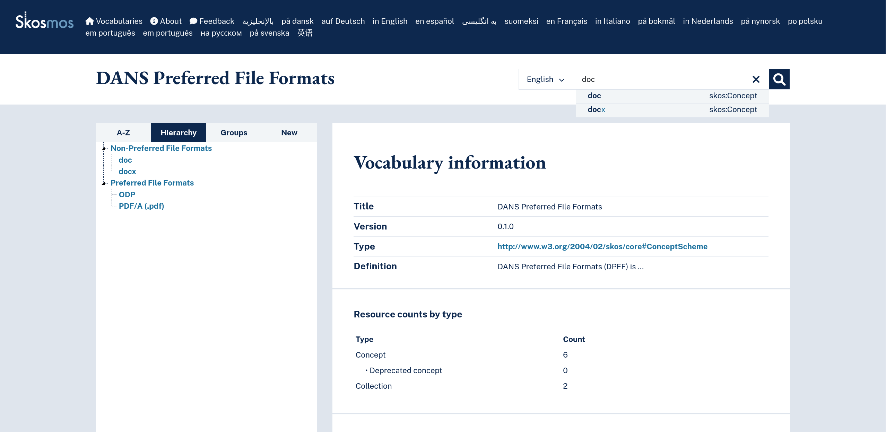
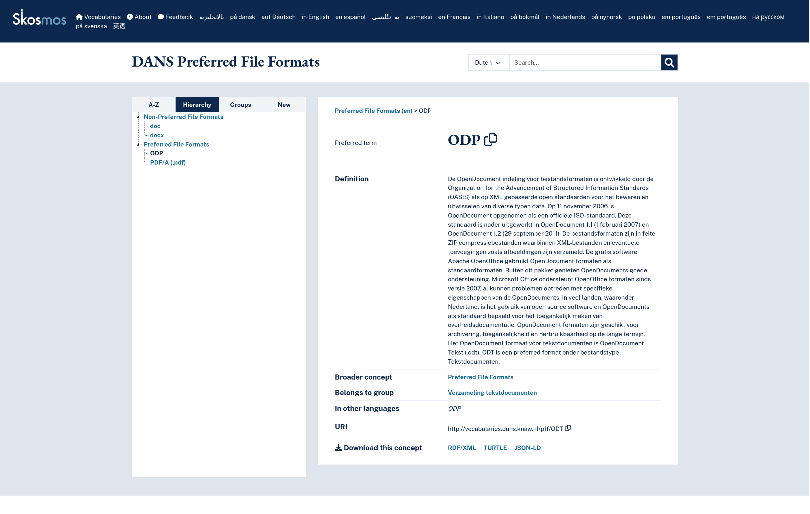
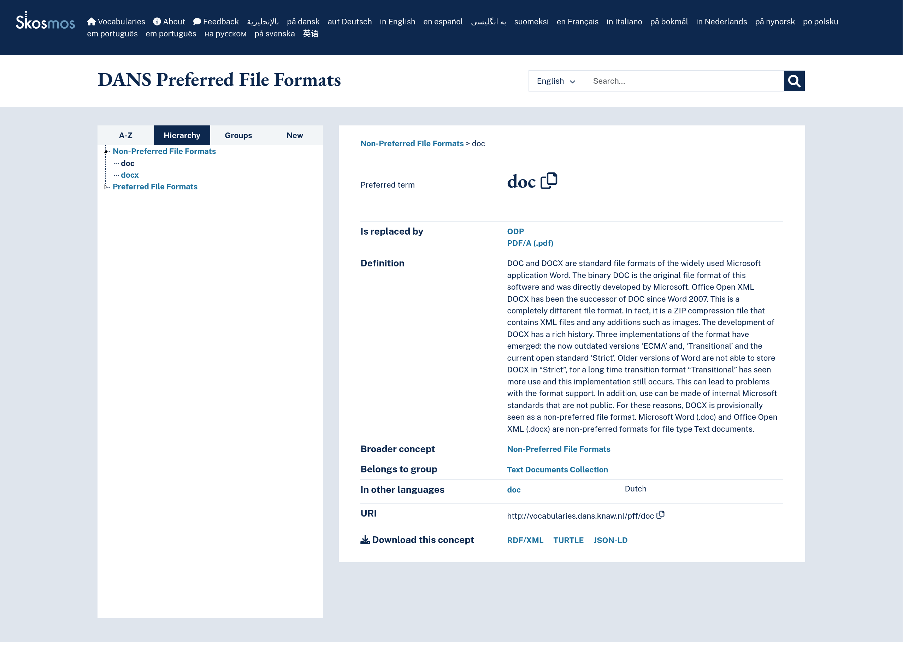

# DANS Preferred File Formats as a SKOS Artifact

DANS maintains a list of preferred file formats (PFF) in https://dans.knaw.nl/nl/bestandsformaten/ This repository attempts to encode the information contained in PFF in a SKOS taxonomy.

Similar effort was made in DARIAH project. See https://github.com/ekoi/DANS-File-Formats/blob/additional-formats/dans-file-formats.json

## Requirements

### skomos git submodule

* `git submodule add https://github.com/NatLibFi/Skosmos.git`
* append the Skosmos configuration (below) to `Skosmos/dockerfiles/config/config-docker-compose.ttl`
* Start skomos+fuseki docker containers and load voc with `sh skosmos-load-pff.sh`
* Browse DPFF in Skosmos: http://localhost:9090/DPFF

DPFF Skosmos config 

```
:DPFF a skosmos:Vocabulary, void:Dataset ;
dc:title "DANS Preferred File Formats"@en ;
skosmos:shortName "DPFF";
dc:subject :cat_general ;
void:uriSpace "http://vocabularies.dans.knaw.nl/DPFF/";
skosmos:language "en", "nl";
skosmos:defaultLanguage "en";
skosmos:showTopConcepts true ;
skosmos:fullAlphabeticalIndex false ;
skosmos:groupClass skos:Collection ;
void:sparqlEndpoint <http://fuseki-cache:80/skosmos/sparql> ; 
skosmos:sparqlGraph <http://vocabularies.dans.knaw.nl/DPFF/> .
```

### python venv & requirements

* Activate you python virtual environment
* install requirements: `pip install -r requirements.txt`
* install the sparqlkernel into jupyter `jupyter sparqlkernel install --user`


## Data source
[Hierarchy-Preferred-Formats.csv](Hierarchy-Preferred-Formats.csv) is based on the list of PFFs maintained by DANS in Google doc [R.0.2 Curated Support Documentation](https://docs.google.com/spreadsheets/d/1hJtnGgO0FWQj4fMjhSIqtmW2lBt1_lI4fMlkgugHMXQ/edit?usp=sharing) 

<!-- 
changes:

* `isPreferred` column was added, with values: `PreferredFileFormats` and `nonPreferredFileFormats`
* rows addressing more than one format were split into several rows
* renamed: 
    * "Document Hierarchy" -> "Collection"
    * "Fileformat" -> "Concept"
    * 
-->

## PFF SKOS artifact Structure

<!-- TODO -->

## SKOSMOS






