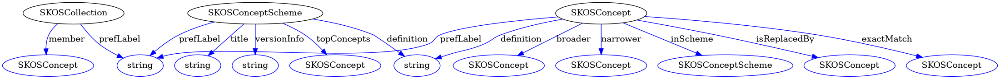

# DANS Preferred File Formats as a SKOS Artifact

DANS maintains a list of preferred file formats (PFF) in https://dans.knaw.nl/nl/bestandsformaten/ This repository attempts to encode the information contained in PFF in a SKOS taxonomy.

Similar effort was made in DARIAH project. See https://github.com/ekoi/DANS-File-Formats/blob/additional-formats/dans-file-formats.json

## DANS PFF Data

[pff-skos.ttl](pff-skos.ttl) [PROTOTYPE]- contains the DANS PFF data in Skos (turtle RDF)  

## DANS PFF Data Model

Define using LinkML in [pff-schema.yaml](pff-schema.yaml)

 

generated via `linkml generate graphviz -f png -o imgs/pff-schema pff-schema.yaml`

### Data Model Summary table

generated with `linkml generate summary pff-schema.yaml | pandoc -f tsv -t gfm`


| Class Name        | Parent Class | YAML Class Name   | Description                                         | Flags | Slot Name    | YAML Slot Name | Range             | Card  | Slot Description | URI                |
|-------------------|--------------|-------------------|-----------------------------------------------------|-------|--------------|----------------|-------------------|-------|------------------|--------------------|
| SKOSCollection    |              | SKOSCollection    | SKOS Collection grouping Concepts                   |       |              |                |                   |       |                  |                    |
|                   |              |                   |                                                     |       | prefLabel    |                | str               | 0..\* |                  | skos:prefLabel     |
|                   |              |                   |                                                     |       | member       |                | SKOSConcept       | 0..\* |                  | skos:member        |
| SKOSConcept       |              | SKOSConcept       | SKOS Concept representing a file format             |       |              |                |                   |       |                  |                    |
|                   |              |                   |                                                     |       | prefLabel    |                | str               | 0..\* |                  | skos:prefLabel     |
|                   |              |                   |                                                     |       | definition   |                | str               | 0..\* |                  | skos:definition    |
|                   |              |                   |                                                     |       | broader      |                | SKOSConcept       | 0..1  |                  | skos:broader       |
|                   |              |                   |                                                     |       | narrower     |                | SKOSConcept       | 0..\* |                  | skos:narrower      |
|                   |              |                   |                                                     |       | inScheme     |                | SKOSConceptScheme | 0..1  |                  | skos:inScheme      |
|                   |              |                   |                                                     |       | isReplacedBy |                | SKOSConcept       | 0..\* |                  | dct:isReplacedBy   |
|                   |              |                   |                                                     |       | exactMatch   |                | SKOSConcept       | 0..1  |                  | skos:exactMatch    |
| SKOSConceptScheme |              | SKOSConceptScheme | SKOS Concept Scheme for DANS Preferred File Formats |       |              |                |                   |       |                  |                    |
|                   |              |                   |                                                     |       | title        |                | str               | 0..1  |                  | dct:title          |
|                   |              |                   |                                                     |       | prefLabel    |                | str               | 0..\* |                  | skos:prefLabel     |
|                   |              |                   |                                                     |       | definition   |                | str               | 0..\* |                  | skos:definition    |
|                   |              |                   |                                                     |       | versionInfo  |                | str               | 0..1  |                  | owl:versionInfo    |
|                   |              |                   |                                                     |       | topConcepts  |                | SKOSConcept       | 0..\* |                  | skos:hasTopConcept |


## DANS PDF Data source
[Hierarchy-Preferred-Formats.csv](Hierarchy-Preferred-Formats.csv) is based on the list of PFFs maintained by DANS in Google doc [R.0.2 Curated Support Documentation](https://docs.google.com/spreadsheets/d/1hJtnGgO0FWQj4fMjhSIqtmW2lBt1_lI4fMlkgugHMXQ/edit?usp=sharing) 

<!-- 
changes:

* `isPreferred` column was added, with values: `PreferredFileFormats` and `nonPreferredFileFormats`
* rows addressing more than one format were split into several rows
* renamed: 
    * "Document Hierarchy" -> "Collection"
    * "Fileformat" -> "Concept"
    * 
-->


## Possible future connections with other registries

* NDE Guide to Prefered Formats https://www.wegwijzervoorkeursformaten.nl/index.php/Doorzoek_Register_op_toepassingsgebied
* IANA Media Types http://www.iana.org/assignments/media-types/media-types.xhtml (DCAT-AP recommendation for domain DCAT:Distribution dcat:mediaType)
* EU Vocabularies File Type Named Authority List http://publications.europa.eu/resource/authority/file-type (DCAT-AP dct:format domain DCAT:Distribution, DCAT:DataService)

## DANS PFF in Skosmos


# Development

## Development Requirements

### skomos git submodule

* `git submodule add https://github.com/NatLibFi/Skosmos.git`
* append the Skosmos configuration (below) to `Skosmos/dockerfiles/config/config-docker-compose.ttl`
* Start skomos+fuseki docker containers and load voc with `sh skosmos-load-pff.sh`
* Browse DPFF in Skosmos: http://localhost:9090/DPFF

DPFF Skosmos config

```
:DPFF a skosmos:Vocabulary, void:Dataset ;
dc:title "DANS Preferred File Formats"@en ;
skosmos:shortName "DPFF";
dc:subject :cat_general ;
void:uriSpace "http://vocabularies.dans.knaw.nl/DPFF/";
skosmos:language "en", "nl";
skosmos:defaultLanguage "en";
skosmos:showTopConcepts true ;
skosmos:fullAlphabeticalIndex false ;
skosmos:groupClass skos:Collection ;
void:sparqlEndpoint <http://fuseki-cache:80/skosmos/sparql> ; 
skosmos:sparqlGraph <http://vocabularies.dans.knaw.nl/DPFF/> .
```

### python venv & requirements

* Activate you python virtual environment
* install requirements: `pip install -r requirements.txt`
* install the sparqlkernel into jupyter `jupyter sparqlkernel install --user`


