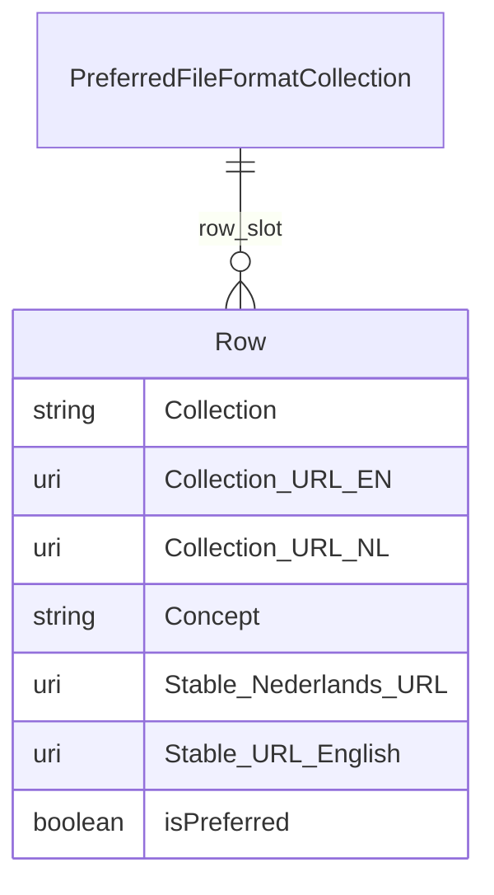
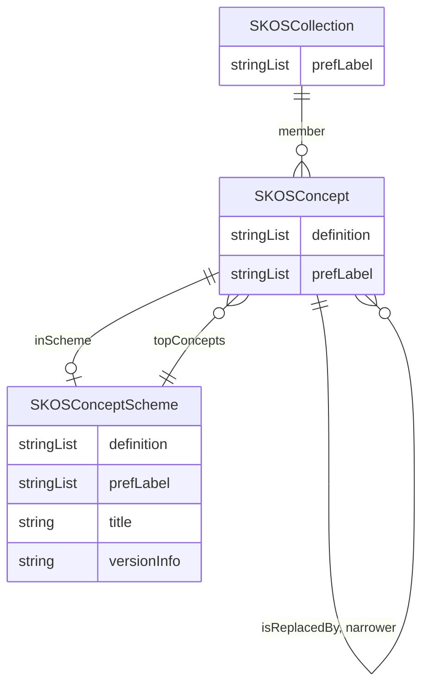

# DANS Preferred File Formats as a SKOS

DANS maintains a list of preferred file formats (PFF) in https://dans.knaw.nl/nl/bestandsformaten/ This repository attempts to encode the information contained in PFF in a SKOS taxonomy.

Similar effort was made in DARIAH project. See https://github.com/ekoi/DANS-File-Formats/blob/additional-formats/dans-file-formats.json

## Source: DANS PFF

### Source Data: DANS PFF (CSV)

[pff-src.csv](pff-src.csv) is based on the list of PFFs maintained by DANS in Google doc [R.0.2 Curated Support Documentation](https://docs.google.com/spreadsheets/d/1hJtnGgO0FWQj4fMjhSIqtmW2lBt1_lI4fMlkgugHMXQ/edit?usp=sharing) 

<!-- 
changes:

* `isPreferred` column was added, with values: `PreferredFileFormats` and `nonPreferredFileFormats`
* rows addressing more than one format were split into several rows
* renamed: 
    * "Document Hierarchy" -> "Collection"
    * "Fileformat" -> "Concept"
    * 
-->

### Source Schema

[schemas/pff-src.linkml.yaml](schemas/pff-src.linkml.yaml)



```mermaid
erDiagram
PreferredFileFormatCollection {

}
Row {
    string Collection  
    uri Collection_URL_EN  
    uri Collection_URL_NL  
    string Concept  
    uri Stable_Nederlands_URL  
    uri Stable_URL_English  
    boolean isPreferred  
}

PreferredFileFormatCollection ||--}o Row : "row_slot"

```

Diagram generated by: `linkml generate erdiagram -f markdown schemas/pff-src.linkml.yaml`


### Source: convert CSV to RDF

convert: `linkml-convert --schema schemas/pff-src.linkml.yaml -t rdf pff-src-SAMPLE.csv`

sample output:

```
@prefix dpff: <http://vocabularies.dans.knaw.nl/pff/> .
@prefix xsd: <http://www.w3.org/2001/XMLSchema#> .

[] a dpff:PreferredFileFormatCollection ;
    dpff:row_slot [ a dpff:Row ;
            dpff:Collection "Spreadsheets" ;
            dpff:Collection_URL_EN "https://dans.knaw.nl/en/file-formats/spreadsheets/"^^xsd:anyURI ;
            dpff:Collection_URL_NL "https://dans.knaw.nl/bestandsformaten/spreadsheets/"^^xsd:anyURI ;
            dpff:Concept "Microsoft Excel (.xls)" ;
            dpff:Stable_Nederlands_URL "https://dans.knaw.nl/bestandsformaten/spreadsheets/microsoft-excel/"^^xsd:anyURI ;
            dpff:Stable_URL_English "https://dans.knaw.nl/en/file-formats/spreadsheets/microsoft-excel/"^^xsd:anyURI ;
            dpff:isPreferred false ],
        [ a dpff:Row ;
            dpff:Collection "Plain text" ;
            dpff:Collection_URL_EN "https://dans.knaw.nl/en/file-formats/plain-text/"^^xsd:anyURI ;
            dpff:Collection_URL_NL "https://dans.knaw.nl/nl/bestandsformaten/platte-tekst/"^^xsd:anyURI ;
            dpff:Concept "Unicode text (.txt)" ;
            dpff:Stable_Nederlands_URL "https://dans.knaw.nl/bestandsformaten/platte-tekst/unicode/"^^xsd:anyURI ;
            dpff:Stable_URL_English "https://dans.knaw.nl/en/file-formats/plain-text/unicode/"^^xsd:anyURI ;
            dpff:isPreferred true ] .
```


## Source: HTML Content

Scrapped with [scripts/scrape_pffs_html_pages.py](scripts/scrape_pffs_html_pages.py) `python scripts/scrape_pffs_html_pages.py`

Using the URLs from [pff-src.csv](pff-src.csv) and saving HTML content to [html/](html/), in sub folders:

```
html/
├── collection_urls_en - collections@en (ie html/collection_urls_en/audio.html)
├── collection_urls_nl - collections@nl (ie html/collection_urls_en/audio.html)
├── stable_urls_en - concepts@en (ie html/stable_urls_en/aac.html)
└── stable_urls_nl - concepts@nl (ie html/stable_urls_nl/aac.html)
```


From columns: Collection_URL_NL, Collection_URL_EN, Stable URL English, Stable Nederlands URL

Example: CSV values
* `https://dans.knaw.nl/nl/bestandsformaten/tekstdocumenten` saved to `html/nl/tekstdocumenten.html`
* `https://dans.knaw.nl/en/file-formats/text-documents/` saved to `html/en/text-documents.html`

### HTML structure

There are 2 types of HTML content:

* individual file-formats ie [html/en/aac.html](html/en/aac.html)
* **file format types** ie. [html/en/audio.html](html/en/audio.html)
  * lengthier multi-line descriptions
  * ie  `pandoc -f html -t markdown_strict  html/en/3d.html `    

TODO:

- [ ] destinguish this type of files, perhaps based on origin
- [ ] 


# Output: DANS PFF as SKOS

## Output (SKOS) Schema

**Defined (in LinkML) in [schemas/pff-skos.linkml.yaml](schemas/pff-skos.linkml.yaml)**


```mermaid
erDiagram
SKOSCollection {
    stringList prefLabel  
}
SKOSConcept {
    stringList definition  
    stringList prefLabel  
}
SKOSConceptScheme {
    stringList definition  
    stringList prefLabel  
    string title  
    string versionInfo  
}

SKOSCollection ||--}o SKOSConcept : "member"
SKOSConcept ||--|o SKOSConcept : "broader, exactMatch"
SKOSConcept ||--|o SKOSConceptScheme : "inScheme"
SKOSConcept ||--}o SKOSConcept : "isReplacedBy, narrower"
SKOSConceptScheme ||--}o SKOSConcept : "topConcepts"

```

Diagram generated by: `linkml generate erdiagram -f markdown schemas/pff-skos.linkml.yaml`

[pff-skos.ttl](pff-skos.ttl) [PROTOTYPE]- contains the DANS PFF data in Skos (turtle RDF)

## Transform RDF (CSV structure) to SKOS

`arq --query sparql/construct-row2skosConcept.rq --data pff-src-SAMPLE.ttl`

## SHACL shapes

In [schemas/pff-skos.shacl](schemas/pff-skos.shacl)

`gen-shacl --non-closed schemas/pff-skos.linkml.yaml > schemas/pff-skos-shacl.ttl`

Validate:

`shacl v --shapes schemas/pff-skos-shacl.ttl --data pff-skos.ttl`

**TODO: resolve shape violation due to shapes containing `sh:datatype xsd:string` instead of `sh:datatype xsd:string`**

```
    sh:resultMessage              "DatatypeConstraint[xsd:string]: Expected xsd:string : Actual rdf:langString : Node \"DANS Preferred File Formats\"@en";
```

## DANS PFF in Skosmos


# Development

## Development Requirements

### skomos git submodule

* `git submodule add https://github.com/NatLibFi/Skosmos.git`
* append the Skosmos configuration (below) to `Skosmos/dockerfiles/config/config-docker-compose.ttl`
* Start skomos+fuseki docker containers and load voc with `sh skosmos-load-pff.sh`
* Browse DPFF in Skosmos: http://localhost:9090/DPFF

DPFF Skosmos config

```
:DPFF a skosmos:Vocabulary, void:Dataset ;
dc:title "DANS Preferred File Formats"@en ;
skosmos:shortName "DPFF";
dc:subject :cat_general ;
void:uriSpace "http://vocabularies.dans.knaw.nl/DPFF/";
skosmos:language "en", "nl";
skosmos:defaultLanguage "en";
skosmos:showTopConcepts true ;
skosmos:fullAlphabeticalIndex false ;
skosmos:groupClass skos:Collection ;
void:sparqlEndpoint <http://fuseki-cache:80/skosmos/sparql> ; 
skosmos:sparqlGraph <http://vocabularies.dans.knaw.nl/DPFF/> .
```

### python venv & requirements

* Activate you python virtual environment
* install requirements: `pip install -r requirements.txt`
* install the sparqlkernel into jupyter `jupyter sparqlkernel install --user`


## Possible future connections with other registries

* NDE Guide to Prefered Formats https://www.wegwijzervoorkeursformaten.nl/index.php/Doorzoek_Register_op_toepassingsgebied
* IANA Media Types http://www.iana.org/assignments/media-types/media-types.xhtml (DCAT-AP recommendation for domain DCAT:Distribution dcat:mediaType)
* EU Vocabularies File Type Named Authority List http://publications.europa.eu/resource/authority/file-type (DCAT-AP dct:format domain DCAT:Distribution, DCAT:DataService)
