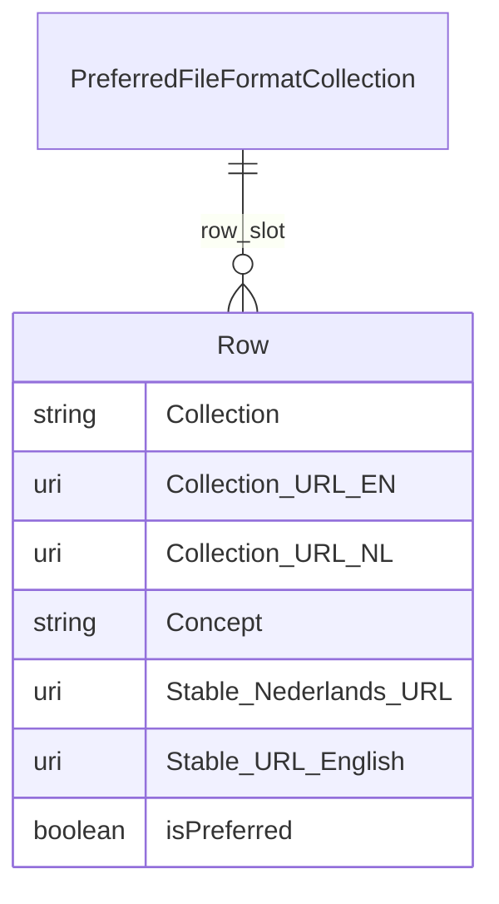
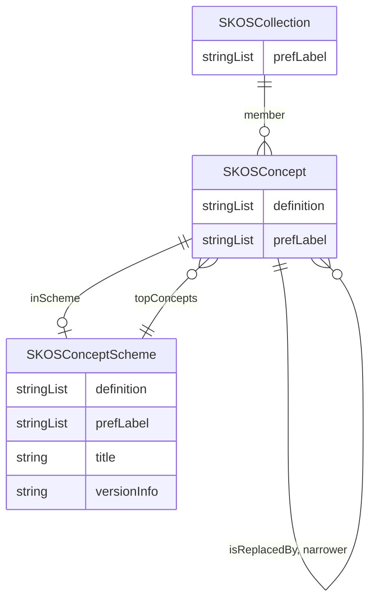
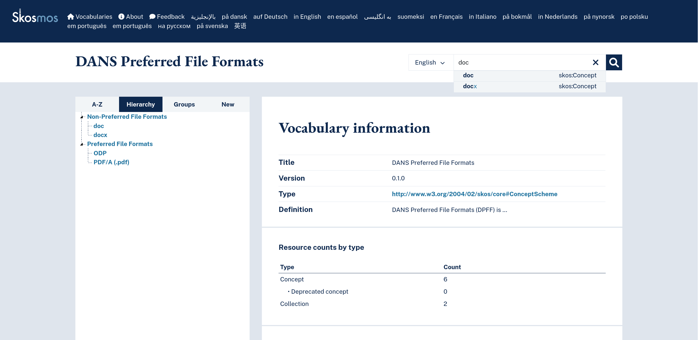
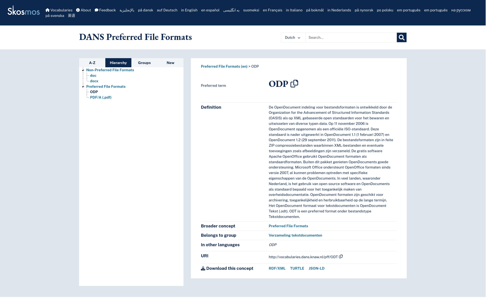
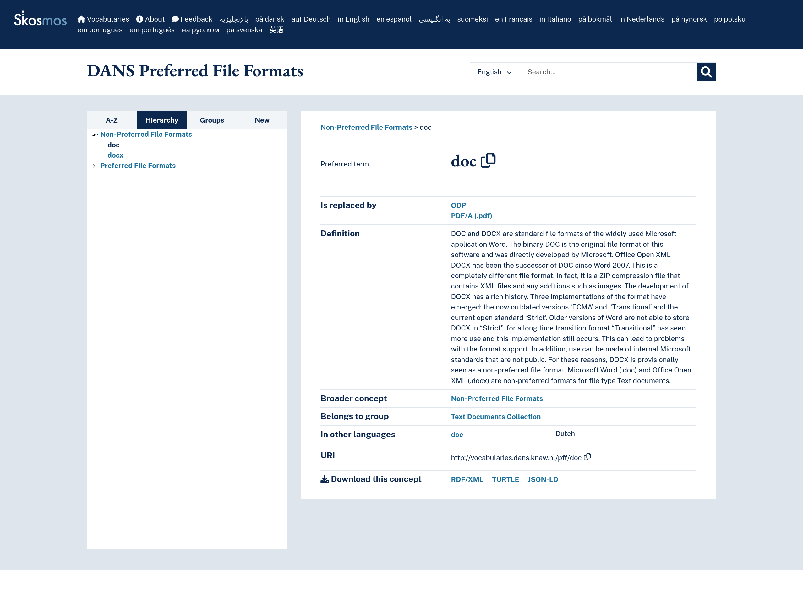

# DANS Preferred File Formats as a SKOS

DANS maintains a list of preferred file formats (PFF) in https://dans.knaw.nl/nl/bestandsformaten/ This repository attempts to encode the information contained in PFF in a SKOS taxonomy.

Similar effort was made in DARIAH project. See https://github.com/ekoi/DANS-File-Formats/blob/additional-formats/dans-file-formats.json

## Source: DANS PFF

### Source Data: DANS PFF (CSV)

[pff-src.csv](pff-src.csv) is based on the list of PFFs maintained by DANS in Google doc [R.0.2 Curated Support Documentation](https://docs.google.com/spreadsheets/d/1hJtnGgO0FWQj4fMjhSIqtmW2lBt1_lI4fMlkgugHMXQ/edit?usp=sharing) 

<!-- 
changes:

* `isPreferred` column was added, with values: `PreferredFileFormats` and `nonPreferredFileFormats`
* rows addressing more than one format were split into several rows
* renamed: 
    * "Document Hierarchy" -> "Collection"
    * "Fileformat" -> "Concept"
    * 
-->

### Source Schema

[schemas/Hierarchy-Preferred-Formats.linkml.yaml](schemas/Hierarchy-Preferred-Formats.linkml.yaml)



```mermaid
erDiagram
PreferredFileFormatCollection {

}
Row {
    string Collection  
    uri Collection_URL_EN  
    uri Collection_URL_NL  
    string Concept  
    uri Stable_Nederlands_URL  
    uri Stable_URL_English  
    boolean isPreferred  
}

PreferredFileFormatCollection ||--}o Row : "row_slot"

```

Diagram generated by: `linkml generate erdiagram -f markdown schemas/Hierarchy-Preferred-Formats.linkml.yaml`

### Source: HTML Content

Scrapped with `python scripts/scrape_pffs_html_pages.py`

Using the URLs from [pff-src.csv](pff-src.csv) and saving HTML content to [html/](html/), according to `/html/<language>/<file>.html.`

From columns: Collection_URL_NL, Collection_URL_EN, Stable URL English, Stable Nederlands URL

Example: CSV values
* `https://dans.knaw.nl/nl/bestandsformaten/tekstdocumenten` saved to `html/nl/tekstdocumenten.html`
* `https://dans.knaw.nl/en/file-formats/text-documents/` saved to `html/en/text-documents.html`

## Output: DANS PFF as SKOS

## Output (SKOS) Schema

**Defined (in LinkML) in [schemas/pff-skos-linkml.yaml](schemas/pff-skos-linkml.yaml)**


```mermaid
erDiagram
SKOSCollection {
    stringList prefLabel  
}
SKOSConcept {
    stringList definition  
    stringList prefLabel  
}
SKOSConceptScheme {
    stringList definition  
    stringList prefLabel  
    string title  
    string versionInfo  
}

SKOSCollection ||--}o SKOSConcept : "member"
SKOSConcept ||--|o SKOSConcept : "broader, exactMatch"
SKOSConcept ||--|o SKOSConceptScheme : "inScheme"
SKOSConcept ||--}o SKOSConcept : "isReplacedBy, narrower"
SKOSConceptScheme ||--}o SKOSConcept : "topConcepts"

```

Diagram generated by: `linkml generate erdiagram -f markdown schemas/pff-skos-linkml.yaml`

[pff-skos.ttl](pff-skos.ttl) [PROTOTYPE]- contains the DANS PFF data in Skos (turtle RDF)


## DANS PFF in Skosmos








# Development

## Development Requirements

### skomos git submodule

* `git submodule add https://github.com/NatLibFi/Skosmos.git`
* append the Skosmos configuration (below) to `Skosmos/dockerfiles/config/config-docker-compose.ttl`
* Start skomos+fuseki docker containers and load voc with `sh skosmos-load-pff.sh`
* Browse DPFF in Skosmos: http://localhost:9090/DPFF

DPFF Skosmos config

```
:DPFF a skosmos:Vocabulary, void:Dataset ;
dc:title "DANS Preferred File Formats"@en ;
skosmos:shortName "DPFF";
dc:subject :cat_general ;
void:uriSpace "http://vocabularies.dans.knaw.nl/DPFF/";
skosmos:language "en", "nl";
skosmos:defaultLanguage "en";
skosmos:showTopConcepts true ;
skosmos:fullAlphabeticalIndex false ;
skosmos:groupClass skos:Collection ;
void:sparqlEndpoint <http://fuseki-cache:80/skosmos/sparql> ; 
skosmos:sparqlGraph <http://vocabularies.dans.knaw.nl/DPFF/> .
```

### python venv & requirements

* Activate you python virtual environment
* install requirements: `pip install -r requirements.txt`
* install the sparqlkernel into jupyter `jupyter sparqlkernel install --user`


## Possible future connections with other registries

* NDE Guide to Prefered Formats https://www.wegwijzervoorkeursformaten.nl/index.php/Doorzoek_Register_op_toepassingsgebied
* IANA Media Types http://www.iana.org/assignments/media-types/media-types.xhtml (DCAT-AP recommendation for domain DCAT:Distribution dcat:mediaType)
* EU Vocabularies File Type Named Authority List http://publications.europa.eu/resource/authority/file-type (DCAT-AP dct:format domain DCAT:Distribution, DCAT:DataService)
